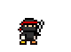
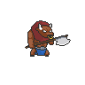
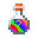
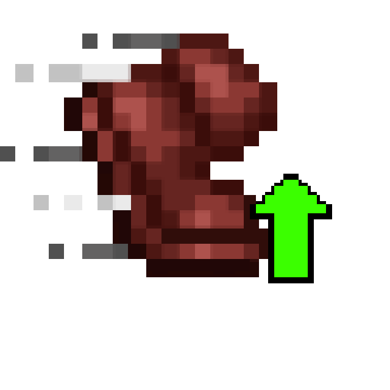
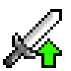
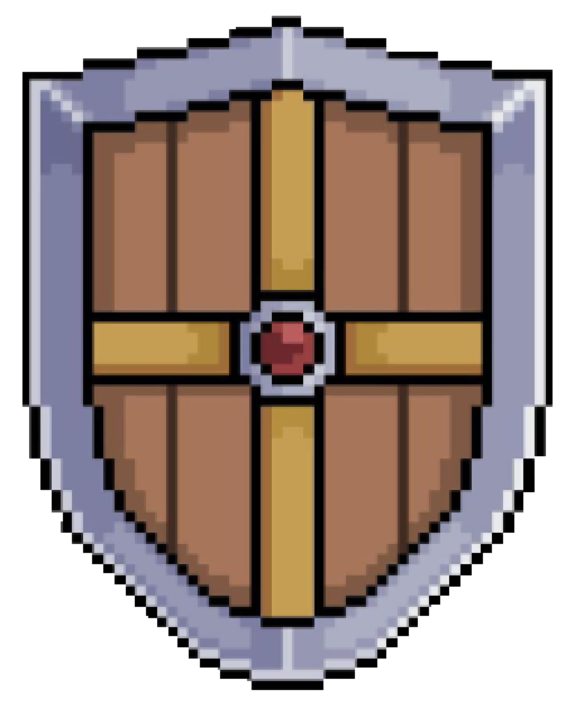
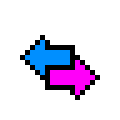
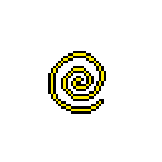

# Ninja Strike
## Demo game
- Link demo:
https://drive.google.com/file/d/134card_hx7m832Cyod9HjoiZfKS_wErD/view?usp=drive_link
## Cách tải game
### Không bao gồm code
  - Chọn Ninja Strike 1.0.0 trong phần Releases của github, tải và giải nén file Ninja.Strike.1.0.0.zip . Chạy file exe để khởi động game.

### Bao gồm cả code
- Vẫn trong phần Releases nhưng bạn hãy tải về Source code, giải nén và chạy project (file cbp) để chạy chương trình và tiến hành chơi game.

## Giới thiệu game
- NinjaStrike là game di chuyển theo map, đánh quái, nhặt trang bị, mang nhiều tính chất ngẫu nhiên.
- Nhân vật trong game là 1 ninja thực thụ ham tìm tòi, khám phá, du ngoạn khắp mọi nơi. Dù ngoài kia có bao khó khăn, nguy hiểm cũng không thể nào ngăn cản anh ấy tìm tới nơi tận cùng của thế giới.
## Các thao tác chơi
### Mô tả chung
- Phần menu, người chơi dùng chuột để lựa chọn các chức năng ở phần menu.
- Người chơi sử dụng các phím mũi tên để di chuyển, ngoài ra còn có double jump - điều không thể thiếu ở 1 tựa game ninja ( bằng cách nhấn 2 lần mũi tên lên ).
- Phím Z để chém kiếm.
- Phím X để ném phi tiêu.

### Tiến hành chơi game
- Trong phần menu, bạn có thể chọn "Start game" để tiến hành chơi hoặc chọn "Quit" để thoát game.
- Sau khi hoàn thành 1 lượt chơi sẽ hiện màn hình thông báo số điểm và các chức năng liên quan.
  - Nếu bạn muốn chơi lại, chọn "Restart".
  - Hoặc bạn có thể chọn "Back to Menu" để quay trở lại màn hình chính.

## Cơ chế game

### Mục tiêu
- Người chơi điều khiển nhân vật vượt chướng ngại vật, đánh quái, nhặt bình thuốc để giành được số điểm cao nhất.
- Điểm số phụ thuộc vào quãng đường đã đi, quái giết được và số bình thuốc nhặt được.

### Các thành phần trong game:

- Nhân vật 

- Kẻ địch  

- Bình thuốc 

- Khi nhặt bình thuốc, người chơi sễ nhận được các hiệu ứng ngẫu nhiên, bao gồm:

  

  - SpeedBoost: Tăng tốc chạy.
  

  

  - DmgBoost: Tăng sát thương.
  

  

     - Invincible: Miễn nhiễm sát thương nhận vào.
  

  

  - Reverse Control: Đảo ngược thao tác điều khiển.
  

  

  - Stun: khiến nhân vật bị choáng.
  

  Ngoài ra còn có hiệu ứng Heal để hồi lại máu cho người chơi.
  

  ( Tips: Nếu nhân vật bị choáng trên không thì hãy spam nhảy, có khả năng cứu sống bạn đó )
  

- Mọi yếu tố trong game đều phụ thuộc vào sự may mắn của bạn :))
## Điểm nổi bật của game
- Điều khiển mượt mà, âm thanh sống động.
- Lối chơi cuốn hút với chức năng ngẫu nhiên vật phẩm.
## Hướng phát triển sau này
- Thêm chức năng điều khiển khác cho nhân vật.
- Thêm nhiều loại hiệu ứng mới khi nhặt bình thuốc.
- Thêm nhiều loại quái vật với các đặc điểm khác chiến đấu khác nhau.
- Tạo thêm nhiều địa hình và bản đồ đa dạng hơn.

## Cấu trúc project
- Collision: Dùng để kiểm tra va chạm giữa các đối tượng.
- Config.h : Dùng để lưu biến toàn cục.
- Enemy: Quản lý kẻ địch.
- EnemyAI: khởi tạo AI đơn giản để kiểm soát hành vi của kẻ địch.
- Game: Kiểm soát các đối tượng trong vòng đời game.
- GameOverScreen: Khởi tạo màn hình khi game kết thúc, tương tác giữa game và menu.
- main: file chính.
- Map: Dùng để đọc và vẽ map từ file json.
- Menu: Khởi tạo, quản lý màn hình chính.
- Player: Khởi tạo, quản lý, thao tác nhân vật.
- Potion: Khởi tạo, quản lý chức năng của thuốc.
- Shuriken: tạo ra phi tiêu.
- SoundManager: Quản lý âm thanh.
- SpriteSheet: quản lý animation.
- Texture: Class đơn vị cấu thành các file còn lại trong project, dùng để đọc, tải hình ảnh.
- Ngoài ra còn có các file json, tinyxml2 được tải về để bổ trợ quá trình hoàn thành project.

## Nguồn tham khảo
- Tìm hiểu về SDL:
  - [Tài liệu của trường](https://docs.google.com/document/d/1FZ3jTqHxtyZznNWiJmmve0zYu_aSliUqLP2OsMcdehQ/edit?tab=t.0#heading=h.g69r5ua9lzeh)
  - https://lazyfoo.net
  - https://phattrienphanmem123az.com/lap-trinh-game-cpp
- Cách làm map và đọc trong chương trình: 
  - https://www.youtube.com/playlist?list=PLu4oc9P-ABcOXNOyoAvnMyUwn_kkiVA5B

## Lời tổng kết
Em xin chân thành cảm ơn thầy cô, bạn bè đã đồng hành cùng em trong suốt chặng đường hoàn thành tựa game này. Chúc mọi người có một trải nghiệm đáng nhớ với tựa game mà em tạo ra.

Em xin chân thành cảm ơn thầy  cô, các bạn và mọi người đã dành thời gian để đọc.

 ❤️❤️
